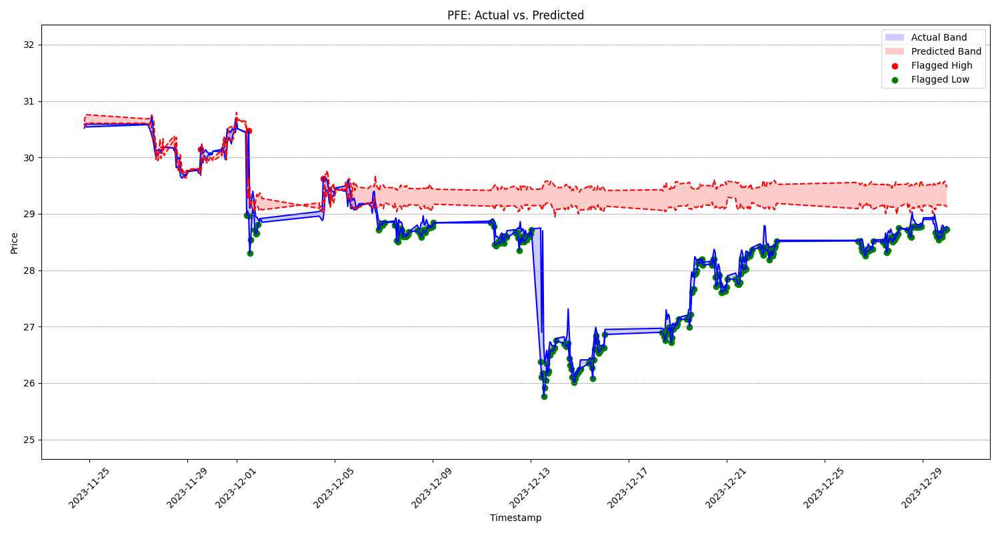

# Project Title: Quest Reborn

## Description
Quest Reborn is a stock market data analysis tool designed to fetch, download, and update market data for a given list of stocks. Utilizing this data in tandem with machine learning algorithms, Quest Reborn outputs predictions for stock performance, aiding in investment decision-making.

## Features
- **Portfolio Market Data Analysis**: Downloads and analyzes the market data of your portfolio, applying machine learning algorithms for predictive insights.
- **Custom Market List Monitoring**: Allows the creation of custom lists of markets to monitor, ensuring you keep an eye on specific sectors or stocks of interest.
- **Candle Data Updating**: Regularly updates candle data to ensure the most current market information is used in predictions and analyses.

## Requirements

1. To set up the Quest Reborn application, ensure you have Python 3.11 installed. 
2. Ensure that you have your Questrade API token ready.
   - https://www.questrade.com/api/documentation/getting-started

## Installation

Follow these steps:

1. **Clone the Repository**:
   ```
   git clone https://github.com/yaloo88/Quest.git
   ```

2. **Navigate to the Project Directory**:
   ```
   cd Quest
   ```

3. **Install Dependencies**:
   ```
   pip install -r requirements.txt
   ```

4. **Execute the First Run**:
   - This is where you will need your Questrade API token.
   ```
   first_touch.bat
   ```

5. **Update Candles and Predict**:
   ```
   predict.bat
   ```

6. **Link to Your Discord Server**:
    - Input your Discord key into the specified file.
   ```
   predict_discord.bat
   ```

## Usage

Quest Reborn is straightforward to use once set up:

1. Run `predict.bat` to update candle data and generate market predictions.
2. Use `predict_discord.bat` to link these predictions with your Discord server. Make sure your Discord webhook_url is correctly inputted in the designated file. 
Put the URL of your Discord server into the `webhook_url` variable in the `scripts\xgboost_discord.py` file.

3. Run `first_touch.bat` to create a custom market list and add your stocks of interest
   - This will need the symbol values of the stocks you wish to add to the list. (CASE SENSITIVE)
   - Run `scripts\symbol_search.py` if you need to search for the symbol value.

4. Use `update_candles.bat` to update all candle data. (ommitting the predictions)
   - This will update all candle data for all markets in the data\candles folder. 


Quest Reborn is capable of handling a variety of market data analysis tasks, offering machine learning-based predictions to inform your investment strategies.

## Performance Notice

**Hardware Dependency**: Please note that the performance and speed of the Quest Reborn tool are heavily dependent on the specifications of your hardware, particularly your CPU. Users with more powerful CPUs may experience faster data processing and analysis.

## Disclaimer

**Hardware Damage**: While Quest Reborn is designed to be safe for general use, the developers are not responsible for any potential damage to your hardware resulting from the use of this tool. It is recommended to monitor your hardware's performance and ensure it is capable of handling intensive tasks.

**Investment Risks**: Quest Reborn provides market predictions and analyses based on machine learning algorithms. However, like all tools in the financial market, it does not guarantee profit and should not be the sole basis for your investment decisions. Investing in the stock market involves risks, including the potential loss of principal. Users should be aware of these risks and make investment decisions prudently and under their own discretion.

**No Financial Advice**: The information provided by Quest Reborn is for informational purposes only and should not be considered financial advice. Users are advised to consult with a qualified professional before making any financial decisions.

## Join Our Discord Community

For support, discussions, and updates about Quest Reborn, join our Discord community: [Join Quest Reborn Discord](https://discord.gg/YDGYsJw4XQ)
